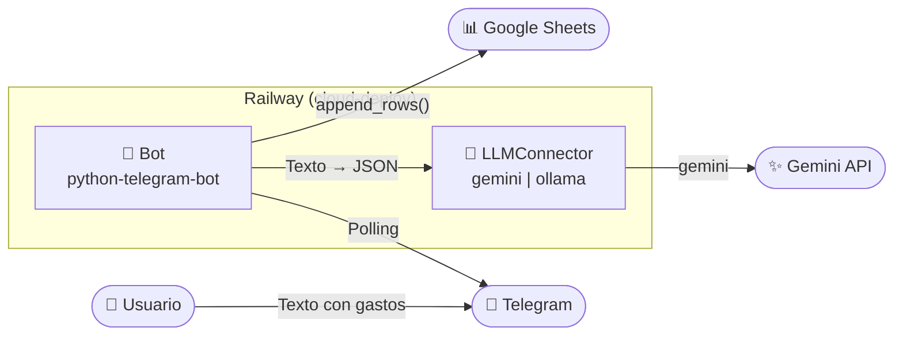
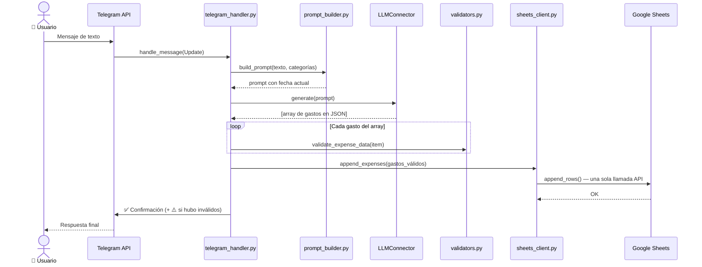

# Bot de Telegram para Registro de Gastos

Bot de Telegram que procesa mensajes de texto en lenguaje natural sobre gastos y los registra automáticamente en Google Sheets usando Gemini como LLM. Desplegado en Railway.

## 🎯 Objetivo

Reducir la fricción al registrar gastos personales: escribís el gasto en Telegram como lo dirías en voz alta, y el bot lo anota en tu planilla con categoría, monto y fecha correctos.

## 🌟 Características

- 🤖 **Lenguaje natural**: "super 45", "taxi 12 ayer", "cena con amigos 80 el viernes"
- 📦 **Múltiples gastos en un mensaje**: "spotify y chatgpt 30" → dos filas separadas; si una es inválida, las demás se guardan igual
- 📊 **Registro automático en Google Sheets**: descripción, categoría, monto y fecha
- 🔐 **Acceso restringido**: solo el usuario autorizado puede usar el bot (`ALLOWED_USER_ID`); sin esta variable el bot no arranca
- 🧠 **LLM configurable**: Gemini (cloud) u Ollama (local)
- ⚙️ **100% configurable** vía variables de entorno

## 📂 Categorías

| Categoría | Uso |
|-----------|-----|
| `Vivienda` | Alquiler, expensas |
| `Comida` | Supermercado, verdulería, fiambrería |
| `Compras` | Ropa, tecnología, Amazon, hogar |
| `Suscripciones` | ChatGPT, Spotify, iCloud, apps |
| `Ocio` | Cine, bares, eventos, juegos |
| `Educacion` | Universidad, cursos, libros, exámenes |
| `Personal` | Peluquería, cuidado personal, regalos |
| `Otros` | Solo como categoría de respaldo |

Personalizables vía `EXPENSE_CATEGORIES` en las variables de entorno.

## 🧠 ¿Por qué usar un LLM?

El LLM actúa únicamente como capa de interpretación — convierte texto libre en JSON estructurado. La lógica de negocio y la persistencia son determinísticas.

Ventajas frente a regex o comandos estructurados:
- Entrada libre: "pagué el super", "almuerzo con Juan", "renovar icloud"
- Categorización automática sin que el usuario recuerde las categorías exactas
- Soporte natural para fechas relativas (ayer, el viernes, la semana pasada)
- Múltiples gastos en un solo mensaje

El modelo recibe el mensaje, la fecha de hoy y las categorías válidas, y devuelve un **array JSON**:
```json
[{"monto": 45, "categoria": "Comida", "fecha": "2025-08-23", "descripcion": "super"}]
```

### Conectores LLM

| Conector | Ventajas | Requisitos |
|----------|----------|------------|
| `gemini` | Sin infraestructura local, fácil de desplegar | API key de Google AI Studio (gratuita) |
| `ollama` | Privado, sin costos de API | Ollama instalado con modelo descargado |

## 🏗️ Arquitectura





## ⚠️ Limitaciones

- La precisión depende del modelo y del prompt.
- No existe corrección automática ante errores del modelo.

## 📋 Requisitos Previos

1. **Python 3.9+**
2. **Gemini API key** — gratuita en [aistudio.google.com](https://aistudio.google.com)
3. **Google Cloud** con Sheets API y Drive API habilitadas
4. **Bot de Telegram** creado via @BotFather
5. Cuenta en [Railway](https://railway.app) (login con GitHub)

## 🚀 Despliegue en Railway

### 1. Crear Bot de Telegram

1. Abre Telegram → busca **@BotFather** → `/newbot`
2. Copia el token
3. Busca **@userinfobot** → envíale cualquier mensaje → copia tu user ID

### 2. Configurar Google Sheets

1. [console.cloud.google.com](https://console.cloud.google.com) → nuevo proyecto
2. Habilitar **Google Sheets API** y **Google Drive API**
3. IAM → Service Accounts → crear → descargar JSON de credenciales
4. Crear una Google Sheet y compartirla con el `client_email` del JSON (permiso Editor)
5. Copiar el Spreadsheet ID de la URL: `spreadsheets/d/{ID}/edit`

### 3. Desplegar en Railway

1. [railway.app](https://railway.app) → Login with GitHub
2. New Project → Deploy from GitHub repo → seleccionar este repo, rama **`cloud-deploy`**
3. En **Variables**, configurar:

| Variable | Valor |
|----------|-------|
| `TELEGRAM_BOT_TOKEN` | Token de @BotFather |
| `ALLOWED_USER_ID` | Tu Telegram user ID (de @userinfobot) |
| `LLM_CONNECTOR` | `gemini` |
| `GEMINI_API_KEY` | API key de Google AI Studio |
| `GEMINI_MODEL` | `gemini-2.0-flash` |
| `GOOGLE_CREDENTIALS_JSON` | Contenido completo del JSON de credenciales (una línea) |
| `SPREADSHEET_ID` | ID de tu Google Sheet |
| `SHEET_NAME` | Nombre de la pestaña (ej: `Лист1`) |
| `EXPENSE_CATEGORIES` | `Vivienda,Comida,Compras,Suscripciones,Ocio,Educacion,Personal,Otros` |

Railway desplegará automáticamente y re-desplegará con cada push a `cloud-deploy`.

### Actualizar el bot

```bash
# Hacer cambios, luego:
git push origin cloud-deploy
# Railway redespliega solo en ~1 minuto
```

## 💻 Ejecución local

```bash
git clone https://github.com/StepanovArt/expense-tracker
cd expense-tracker
git checkout cloud-deploy

python3 -m venv .venv
source .venv/bin/activate
pip install -e .

cp .env.example .env
# Editar .env con tus valores (usar GOOGLE_CREDENTIALS_PATH para archivo local)

python run.py
```

## 🎯 Uso

### Comandos

- `/start` — mensaje de bienvenida y ejemplos
- `/help` — categorías disponibles y consejos

### Ejemplos de mensajes

```
super 45
taxi 12 ayer
spotify y chatgpt 30
cena con amigos 80 el viernes
alquiler 1200 y expensas 150
```

El bot entiende:
- ✅ Montos en distintos formatos
- ✅ Fechas relativas (ayer, el lunes, la semana pasada)
- ✅ Múltiples gastos en un mismo mensaje
- ✅ Éxito parcial: si un gasto es inválido, los demás se registran igual

## 🔧 Troubleshooting

### El bot no responde
- Verificar que `TELEGRAM_BOT_TOKEN` no tiene espacios al inicio/fin
- Verificar que `ALLOWED_USER_ID` es correcto (obtenerlo con @userinfobot)
- Revisar logs en Railway → Deployments

### Error de Google Sheets
- Verificar que la hoja fue compartida con el `client_email` del JSON
- Verificar que `SHEET_NAME` coincide exactamente con el nombre de la pestaña
- Verificar que `SPREADSHEET_ID` es correcto

### Error con Gemini
- Verificar que `GEMINI_API_KEY` está configurada correctamente
- Revisar los logs de Railway para el mensaje de error específico

### Categoría no reconocida
- El bot valida que la categoría devuelta por el LLM esté en `EXPENSE_CATEGORIES`
- Si el LLM falla consistentemente con alguna categoría, revisar el nombre en la variable

## 📁 Estructura del Proyecto

```
expense-tracker/
├── src/
│   ├── main.py                 # Entry point
│   ├── config.py               # Configuración desde variables de entorno
│   ├── bot/
│   │   └── telegram_handler.py # Handlers de Telegram
│   ├── llm/
│   │   ├── base.py             # Interfaz base LLMConnector
│   │   ├── factory.py          # Crea el conector según LLM_CONNECTOR
│   │   ├── ollama_client.py    # Implementación Ollama
│   │   ├── gemini_client.py    # Implementación Gemini
│   │   └── prompt_builder.py   # Construye el prompt con fecha y categorías
│   ├── storage/
│   │   └── sheets_client.py    # Cliente Google Sheets (append_rows batch)
│   └── utils/
│       ├── logger.py           # Logging
│       ├── validators.py       # Validación de gastos individuales y listas
│       └── exceptions.py       # Excepciones
├── tests/                      # Tests unitarios
├── Dockerfile                  # Imagen Docker
├── Procfile                    # Comando de arranque para Railway
├── railway.toml                # Configuración de Railway
├── .env.example                # Template de variables de entorno
└── pyproject.toml              # Dependencias
```

## 🔒 Seguridad

- ❌ **Nunca commitees** `.env` ni el JSON de credenciales de Google
- ✅ En Railway, las credenciales van como variables de entorno (`GOOGLE_CREDENTIALS_JSON`), nunca como archivos
- ✅ **Control de acceso obligatorio**: `ALLOWED_USER_ID` es requerido; sin él el bot no arranca. El filtro se aplica a nivel de handler — mensajes de otros usuarios son ignorados sin llegar al código
- ✅ Tu Telegram user ID lo obtenés enviando cualquier mensaje a [@userinfobot](https://t.me/userinfobot)

## 📝 Licencia

Este proyecto es de código abierto. Úsalo y modifícalo como necesites.
